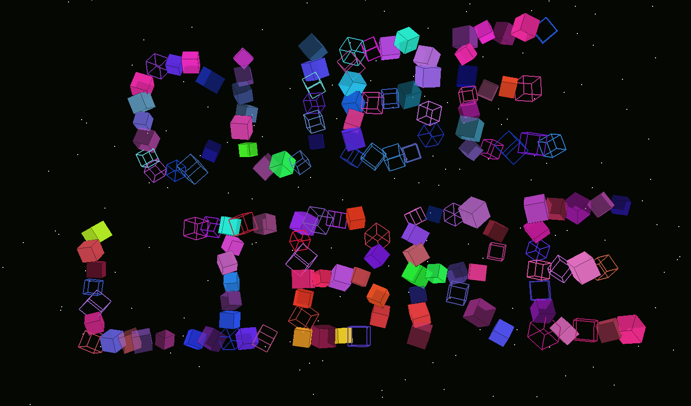

# Cube Libre — Web v0.24.0

<h1 align="center"><a href="https://flyingfathead.github.io/cube-libre/">▶ PLAY THE WEB VERSION HERE</a></h1>

<p align="center"><strong>Play now in your browser. No download or installation needed.</strong><br>
Best played on a desktop computer with a keyboard or an analog game controller.<br>
<strong>Mobile touch controls are now available in beta.</strong></p>

<p align="center">
  <a href="https://flyingfathead.github.io/cube-libre/">
    
  </a>
</p>

A browser-based JavaScript / WebGL 2 port of **Cube Libre** by FlyingFathead,
*with thanks to ChaosWhisperer*. Guide a body of 125 destructible cubes through
rotating laser corridors, recover loose pieces, and reach the portal.

- **Web repository:** https://github.com/FlyingFathead/cube-libre
- **Original PyGame / OpenGL version:** https://github.com/FlyingFathead/cube-libre-pygame

This repository contains the web port. The desktop version is developed separately.
The port is based on original source commit
`ecf8f0148713e5606e64624464eecc4545c71047`.

## Web release 0.24.0 · Mobile controls beta

Android, iPhone and iPad visitors get two choices on the **MOBILE BROWSER DETECTED**
screen: **TRY MOBILE BETA** or **USE KEYBOARD / CONTROLLER**. Space chooses the beta.
The choice is saved in this browser. The same game and Pages address serve both
control modes; a desktop keyboard or analog controller remains recommended.

**Grab the cube itself.** A faint orb surrounds your surviving pieces, with
cyan X, gold Y and pink Z pull arrows. Grab a labelled side and drag along its
beam to move on that axis. The selected axis stays locked until you release,
even as the view rotates. All six grab points remain touchable as overlays,
including underneath/far-side directions and when only one mini-cube survives.
Grab near the orb's centre for free dragging in the screen plane.

A **grey ring marks the rush threshold** around your initial touch point.
Pull beyond it to rush; return inside to slow down. Release to coast, or pull
opposite your current movement to brake. Existing acceleration, speed limits,
collisions, timers, heat, entropy and shutter rules still apply.

The circular **RECOUPLE** button has a whole-cube symbol. It lights up when
pieces are available and dims when there is nothing to recover. Its small label
also explains active recovery, heat restrictions and cooldown. A press requests
re-coupling once; holding it does not repeatedly spend your quota.

**⚙ opens Options directly.** Choose Automatic, Touch beta or Keyboard/controller.
Optional extra drag/depth thumb areas are off by default. Help now has
**KEYBOARD | CONTROLLER | TOUCH | OPTIONS**, including a touch diagram.
Gameplay difficulty switches remain console-only; public Options covers input
preferences and the existing visual effects. In bonus rounds, drag to roll on
the floor and collect by contact; axis/depth and re-coupling controls are hidden.

Touch mode caps drawing resolution at 1.25 device pixels per CSS pixel. Controls
respect screen insets, gestures release on interruptions, and orientation changes
pause play. Fullscreen is optional, including on iPhone. System navigation
remains available. Touch starts proceed while audio loads in the background.

**Beta testing:** automated input, projection and regression checks pass; the
Help diagram was visually inspected. The browser preview could not access the
local game in this environment. Real Android/iPhone/iPad gameplay, layout,
frame rate and control comfort still need device testing. Landscape is suggested.

### Retained from 0.23.0

**Xbox-style controllers are supported**, including analog movement and menus.
Use the left stick for X/Y, LT / RT for Z, **LB to re-couple** (X also works), and
RB to rush. In bonus rounds, the stick rolls on the floor and pieces are picked
up by contact. Help now includes a labeled controller diagram and action list
alongside the keyboard map. Press and release a controller button while the page
is focused to let Firefox detect it. Click or press a keyboard key once if the
browser needs that gesture to enable sound.

**Shutters now leave usable openings.** CHANGE still arrives at level 7, starting
with one eligible gate per leg. The pool increases to two at level 22, three at
36 and four at 50. At most **two gates close at once across the active scene**,
in one leg. The next zap must use another nearby, revealed leg; if no alternative
is available, it waits. Gates are selected randomly by default.

The default interval is four seconds, including a 0.4-second warning and a
0.8-second closure. There is at least 1.2 seconds of open rest before another
warning; increasing this setting extends the interval when necessary. A closed
shutter still removes half the remaining cubes, rounded down, preserves the
last cube, and grants 1.5 seconds of protection from all laser grids.
The ten-second level-50 leg allowance is unchanged.

All of this can be tuned in the debug console (backtick or Ctrl+Shift+F1):

```text
set change_1_max_simultaneous 2
set change_1_no_repeat_leg true
set change_1_gates_per_leg 0
set change_1_gate_cooldown 1.2
viewconfig
```

`change_1_gates_per_leg 0` uses the level ramp; 1–5 overrides the count.
Introduction level, start/end counts, ramp endpoint, warning/closure duration,
interval, damage, immunity and randomness are also editable. See the complete
[settings and progression table](docs/LEVEL_PROGRESSION.md). Boolean preferences
are saved; numeric shutter tuning lasts for the page session.

**The opening map preview is just four exterior lines per corridor**, with no
laser gates or shutter previews. It shows up to 50 legs and fades gradually after
the first two, keeping the distant exit visible. Fifty legs use 200 line segments
in a reusable buffer. Tune it with:

```text
set preview_max_legs 50
set preview_fade_after_legs 2
set preview_opacity 0.24
set preview_far_opacity 0.12
toggle preview_outline
```

The top-right timer now shows **LEG 1/50**, using the actual route length.
**TOP LEVEL: 7/50** remains your highest reached level saved in this browser
across runs, including debug level jumps. Query it with `toplevel` or `top_level`.
Use `toplevel reset`, `top_level reset` or `reset top level` to reset that record
to 1, keeping your best score, best escape, preferences and current run.

**Startup checks the deployed version before play.** A cached older entrypoint
loads a fresh page automatically; JavaScript dependencies, styles and fetched
assets use release-specific URLs. The running version label stays tied to that
build. During an active run, updates still show a dismissible notice instead of
automatically interrupting the run. No GitHub API or separate server is needed.
Refresh once after deploying this update to install the new startup behavior.

### Existing camera, sky and configuration tools

**The camera follows the cube from the first level.** The minimum is now
`auto_locate_min_level = 0`, meaning always on. Full-maze opening overviews still
settle onto the player. `set auto_locate_min_level 3` restores the former threshold;
`set auto_locate_min_level 0` restores the new default. This session setting is
independent of SPACE and corridor culling.

**The default sky is more irregular:** random gaps and clusters, varied point
sizes and brightness, and restrained blue/warm hues. It retains a fixed 1,600 stars
and follows the camera. Compare through the debug console only:

| Command | Background |
| --- | --- |
| `star_pattern 0` | No stars |
| `star_pattern 1` | The original evenly spaced pattern |
| `star_pattern 2` | The new irregular sky, enabled by default |

The browser remembers the pattern. `set star_pattern N` also works. These options
leave the ending's own cinematic starfield intact.

**List every console-settable parameter** with `viewconfig`, `showconfig`,
`showvars`, `viewvars`, `listvars` or `listconfig`. Each row shows its name, current
value, friendly name and description. Use the mouse wheel or Page Up / Page Down
to scroll; the listing reads live settings without changing them.

### Retained from 0.21.0


**Microgravity is on by default in normal levels.** Movement keys apply thrust:
the cube builds speed, coasts briefly when released, and brakes faster when you
steer against its motion. Top speed stays 6 units/second, or 15.6 with Shift.
The drift affects the actual body and collisions. Bonus rounds keep their floor
rolling. Use `set microgravity off` in the debug console to compare with
the original direct controls; `toggle microgravity` and `status microgravity`
work too. The browser remembers the setting.

**HEAT at level 15 now introduces both heat penalties:** the outside grace drops
to 1.4 seconds, and new re-coupling requests are blocked while overheating.
Cooling down restores re-coupling. The check uses the heat state, so future heat
sources can reuse it. Refused requests cost no quota; a request already underway
finishes. Use `set overheat_blocks_recoupling off` to disable this restriction.
The flag defaults to on and is saved through the debug console.

`BALANCE.heatMinLevel` in [`web/js/difficulty.mjs`](web/js/difficulty.mjs) defaults
to **15**; **0 removes the level gate**. Both heat penalties and the HEAT banner
share this setting. `featuresForSettings()` supplies the ordered introduction
schedule, banner titles and Help milestone table; `LEVEL_FEATURES` is its default snapshot. See [the full progression list](docs/LEVEL_PROGRESSION.md).
Thrust response and coasting are tuned in `PLAYER_PROPULSION` in `web/js/config.mjs`.

The package also declares its JavaScript module type explicitly, so local checks
recognize the bundled Three.js modules without depending on Node's automatic
module detection. No npm installation is needed.

### Retained from 0.20.1 and earlier

The ending now lets **YOU'VE ASCENDED** finish fading in and holds it alone for
two seconds before **... FOR NOW.** fades in underneath. The continue prompt
appears afterward. Reassembly messages sit beneath the rebuilding cube with
subtle white outlines for readability.
The README now features the original game's cube-letter logo and the live play
link above. The gameplay additions from 0.20.0 are retained below.
The animated title also fits the space between the start prompt and instructions,
including narrow browser windows and enlarged browser text.

Each level adds **one corridor leg**: level 1 has one, level 2 has two, and level
50 has fifty. X/Z routes gain the Y axis from level 3. The opening camera pulls
back to fit the whole maze as a faint ghost outline, with the distant exit visible
and no red cutting grids. The outline fades as the camera returns to the start.

During play, only nearby corridors and their hazards are detailed. The previous
leg collapses with sound and debris after you clear the next turn; the distant
exit stays marked while the route ahead remains hidden. A fixed starfield follows
the view, so even the largest maps cannot leave it behind.

**Culling is enabled by default.** Compare with `culling false` / `culling true`
(also `0` / `1`) in the debug console. The browser remembers the
choice. Disabling culling shows the surviving route and future previews; the
collision, hazard-reveal and collapse rules continue to apply.

The surviving player collective now tumbles smoothly across **X, Y and Z** in
normal levels. Different slow rates on each axis keep its motion evolving.
It starts turning as it appears.
Every remaining mini-cube moves with the body, including its holes; the rotated
positions determine which pieces hit the field and laser gaps. Re-coupled pieces
settle into the turning body. The aim is to reach the portal with whatever remains.

Rotation is on by default. Use `spin 0` / `spin 1` in the debug console (`false` / `true` also work).
Turning it off restores the body's axis alignment, and the browser remembers
your choice. Bonus rounds keep their own floor rolling and crash animations.
The speed and default live in `PLAYER_ROTATION` in `web/js/config.mjs`.

Laser and field-edge hits now jolt the whole surviving body into a sharp
rotational recoil that settles back into its slow tumble. **Hit rotation shocks**
is enabled by default in Help → Options and has its own saved `rotation_shocks` switch.
The recoil is visual and does not inflict additional collision damage.

All console boolean settings use the same commands, including `locate` and `mute`:

```text
toggle rotation_shocks
set rotation_shocks enabled
status rotation_shocks
```

`toggle <thing>` flips it and replies `<thing> set to true/false`.
`set <thing> <value>` accepts `true/false`, `on/off`, `1/0` and
`enabled/disabled`. `status <thing>`, `view <thing>`, `get <thing>` and
`set <thing>` all report `Status for <thing> is: Enabled` or `Disabled`.
Use `flags` to list them. Unknown names report `<thing> not found!`;
recognized non-boolean controls report `<thing> cannot be toggled with on/off!`.
Numeric `level`, `score` and `cubes` also support status queries.

The ending now begins with **one white cube above an endless blue grid**. It
levitates into a starfield as the camera tilts upward, shrinks into a bright point,
and holds among the stars before everything fades to white. Preview it with
`test ending_1`. The scene lasts ten seconds, followed by the two-second white
hold, ending text and run statistics.

Portals now radiate a white glow that strengthens as you approach, in normal and
bonus rounds. Use `portal_white_light true` / `portal_white_light false`, or
**Help → Options → Portal white light**, to compare it. It is enabled by default and the
browser saves the setting. The effect uses one small glow sprite.
`set level 20` now works as an alias for `level 20`.

Outside the grid, overheating makes the player body vibrate violently and
flash red/orange with white-hot peaks. The effect intensifies with heat and stops
on returning inside. Open **Help → Options → Shaking and heat flashes** to toggle it, or use
`shake 0` / `shake 1` in the console (`false` / `true` also work). The browser saves
your choice. The switch also controls bonus warning tremors and camera jolts.


**PICKING UP THE PIECES · BONUS ROUND 001** follows levels 5, 10, 15…45.
A full cube crashes onto a solid floor and shatters. Roll the surviving mini-cube
through the scattered pieces to rebuild, then climb the ramp to the portal.
You have **45 seconds** after the crash; escape banks **100 points per piece**.
During the final five seconds the body shakes and glows with heat. At zero it
explodes into spinning fragments, then fades to white. A timeout forfeits the
bonus and continues your journey. WASD / arrows roll on
the floor, Shift rushes, and Help shows the matching bonus keyboard diagram.

Open the console with backtick or Ctrl+Shift+F1:

```text
test bonus_round_1
test ending_1
```

After a test bonus, continue to the next level of the active run. If there is no
active level, the destination is the configured first bonus level (currently 5).
The portal now accepts an approaching roll even when the roll would otherwise
finish beyond the back of the platform. `view_end_anim_v1`
remains an alias for the ending. Bonus types, timing and scheduling are configured
in [`web/js/bonus.mjs`](web/js/bonus.mjs), ready for future round types.

After the startup check, the game checks its deployed `web/version.json` for updates every two minutes
and on return to the tab. A newer version pauses play and shows the update notice;
Space dismisses it, and F5 / Refresh reloads the game. Deployment on GitHub Pages
is enough; there is no GitHub API or separate update server.

Help includes **© 2024–2026 FlyingFathead**. The mobile notice offers the touch
beta or keyboard/controller mode. You can change the choice later through ⚙ Options.

## Difficulty and the current ending

Time tightens from 30 seconds per leg at level 5 to 10 seconds at level 50.
Entropy reduces re-coupling yield from 50% at level 10 to 1% at level 50, rounded
to the nearest whole percent. **HEAT** arrives at level 15, shortening the
out-of-bounds overheating grace period from 2.4 to 1.4 seconds. **TIME** returns
at levels 20, 35 and 50 to announce the current allowance. From HEAT onward,
active overheating also blocks new re-coupling requests when its flag is enabled.
The route also grows by one leg each level, so the final level combines fifty
legs with the strictest timer, heat and re-coupling settings.

The current level cap is **50**. Clear it to see a single white cube ascend into the stars,
followed by the ending and your run statistics. Separate Space / Enter / click
inputs advance to the stats and then return to the main menu.

The game reads its version from [`web/version.json`](web/version.json).
Balance settings, including the entropy introduction level and current level cap,
live in [`web/js/difficulty.mjs`](web/js/difficulty.mjs).
The keyboard help, boxed countdown and three-line opening from 0.16.0 are retained.
The top-right timer now reddens near zero, and a bottom-center TIME RESET ... FOR NOW
box flashes whenever a timed leg starts or resets.

The web version continues independently from the **PyGame 0.15.79** baseline.
See [CHANGELOG.md](CHANGELOG.md) for release notes and [WEB_PORT.md](WEB_PORT.md)
for development and deployment details.

## Play and controls

Use a browser with JavaScript, import maps and WebGL 2. Audio starts after interaction.

| Key | Action |
| --- | --- |
| A / D | Move on X |
| W / S | Move on Y |
| Q / E | Move on Z |
| Shift | Rush |
| C | Re-couple loose pieces |
| L | Locate camera |
| H | Help |
| P | Pause |
| M | Mute |
| Esc | Menu |

### Xbox-style controller

| Input | Action |
| --- | --- |
| Left stick / D-pad | Move X/Y; roll on the floor in bonus rounds |
| LT / RT | Move +Z / −Z in normal levels |
| **LB / X** | **Re-couple** on each press |
| RB | Hold to rush |
| A | Start / confirm / continue |
| B | Back / menu |
| Y | Locate cube |
| View / Back | Help |
| Menu / Start | Pause / resume |
| Right stick | Scroll Help and dialogs |

In menus, use the D-pad or left stick to select, then A to activate.
Only one controller controls the game at a time. Disconnecting it pauses play.
`toggle controller` and `set controller_deadzone 0.18` are saved console settings.
A standard browser gamepad mapping is required; custom remapping and rumble are
not included in this release. Hardware/controller playtesting is still needed.

## Run locally

From this repository's root:

```bash
python -m http.server 8000 --directory web
```

Open http://localhost:8000/ (on Windows, `py` can replace `python`).
The complete static game lives in `web/`, including its renderer, font and
20 sounds in Ogg and MP3 (18 originals plus two shutter effects). No backend or npm installation is required.

## GitHub Pages

1. Place this package's contents at the root of `FlyingFathead/cube-libre`,
   including `.github/`. Keep the `web/` directory intact.
2. Select **Settings → Pages → Source → GitHub Actions**.
3. Push to `main` or `master`, or run **Deploy Cube Libre to GitHub Pages**
   from the Actions tab.

The included workflow checks the port and publishes `web/` at
https://flyingfathead.github.io/cube-libre/.

Repository description, homepage and topic commands are in
[docs/GITHUB_METADATA.md](docs/GITHUB_METADATA.md).

## Development

```bash
node tools/check_web.mjs
node --test tests/web/*.test.mjs
```

See [WEB_PORT.md](WEB_PORT.md) for gameplay details, browser differences,
source layout, and optional regeneration using a separate PyGame checkout.
Web 0.23.0 (`acbb831`) is the published baseline. This release passes 128 automated
test groups and static checks, including a complete level-50 traversal, controller
input and menu dispatch, shutter limits, startup cache handling and preview
geometry and tabbed Help. The controller mapping and new visual layout need browser/hardware
playtesting. WebGL effects are recreated and are not pixel-identical to the desktop version.

After changing the version or adding/removing modules, regenerate the committed
startup metadata before the checks:

```bash
node tools/prepare_web_release.mjs
```

© 2024–2026 FlyingFathead. Original authorship and rights remain with the author. The bundled
[Three.js MIT license](web/vendor/THREE-LICENSE.txt) applies to Three.js.
